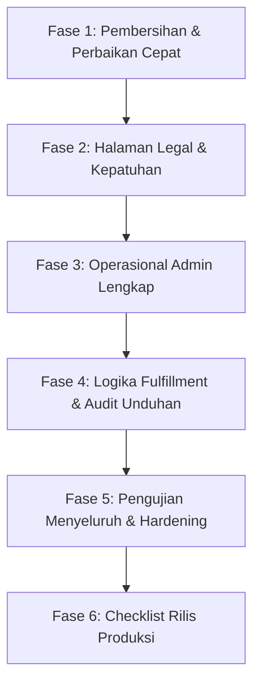

# Rencana Implementasi Fitur Tersisa (Remaining Implementation Plan)
**Proyek:** digital.insani.id  
**Tanggal Dibuat:** 7 September 2026  
**Status Dokumen:** Siap Direview & Dieksekusi  

---

## 1. Ringkasan Eksekutif

Berdasarkan audit menyeluruh terhadap spesifikasi teknis (`doc/01` s/d `doc/22`), fondasi utama aplikasi toko digital (katalog publik, keranjang belanja, *guest checkout*, integrasi Midtrans Snap & webhook, dashboard pembeli, unduhan Google Drive, dan artikel SEO) telah berhasil dibangun.

Namun, terdapat sejumlah fitur fungsional penting yang belum dibuat atau masih berupa mockup, khususnya pada modul **Operasional Admin**, **Halaman Legalitas**, **Detail Logika Fulfillment**, serta **Kerapihan Pengujian (Testing)**.

Dokumen ini disusun sebagai panduan langkah demi langkah (roadmap eksekusi) untuk menyelesaikan seluruh rencana kerja yang tersisa hingga aplikasi 100% siap rilis ke tahap produksi.

---

## 2. Rincian Rencana Implementasi

Rencana kerja ini dibagi menjadi **6 Fase Eksekusi** yang berurutan dan terstruktur:

---

### FASE 1: Pembersihan & Perbaikan Cepat (Bug Fix & Code Cleanup)
*Tujuan: Memastikan baseline codebase bersih dari kode usang dan memperbaiki tes otomatis yang gagal.*

- [x] **1.1 Perbaiki Tes Keranjang yang Gagal (`CartTest.php`)** ✅
  - **Lokasi:** `tests/Feature/CartTest.php`
  - **Status:** Selesai. Tes telah diperbarui untuk menguji kemampuan guest mengakses keranjang belanja dan menambahkan item dengan status 200 OK.
- [x] **1.2 Hapus Rute & Kode Usang (*Dead Code*)** ✅
  - **Lokasi:** `routes/web.php` & `app/Http/Controllers/DownloadController.php`
  - **Status:** Selesai. Rute `member/download/{orderItem}` dan file controller `DownloadController.php` telah dihapus.

---

### FASE 2: Halaman Legal & Kepatuhan Transaksi (Legal & Compliance)
*Tujuan: Menyediakan dokumen kebijakan hukum wajib dan transparansi pembelian bagi pelanggan sebelum melakukan transaksi.*

- [x] **2.1 Buat Controller & Tampilan Halaman Legal** ✅
  - **Rute Baru:**
    - `GET /refund-policy` (`legal.refund`)
    - `GET /terms` (`legal.terms`)
    - `GET /privacy-policy` (`legal.privacy`)
  - **Komponen:**
    - Controller: `app/Http/Controllers/LegalController.php`
    - Halaman React Inertia: `resources/js/pages/Legal/RefundPolicy.tsx`, `Terms.tsx`, `PrivacyPolicy.tsx`.
    - Dilengkapi styling editorial, responsif, dark mode, dan SEO Open Graph metadata.
- [x] **2.2 Integrasikan Tautan Legal pada Navigasi & Footer** ✅
  - Tautan ke Syarat & Ketentuan, Kebijakan Privasi, dan Kebijakan Refund telah ditambahkan pada footer `GuestLayout.tsx`.
- [x] **2.3 Tambahkan Klausul Legal Sebelum Checkout** ✅
  - **Lokasi:** `resources/js/pages/Cart/Index.tsx`
  - **Status:** Klausul persetujuan Syarat & Ketentuan dan Kebijakan Refund telah ditambahkan persis di atas tombol pembayaran keranjang belanja.

---

### FASE 3: Penyempurnaan Operasional Admin (Core Missing Features)
*Tujuan: Melengkapi fitur-fitur manajemen internal yang dibutuhkan oleh pemilik toko dalam operasional harian.*

- [x] **3.1 Manajemen & Monitoring Pesanan (Admin Orders)** ✅
  - **Backend:**
    - Buat controller `app/Http/Controllers/Admin/OrderController.php` (`index`, `show`).
    - Daftarkan rute pada `routes/admin.php`: `admin.orders.index`, `admin.orders.show`.
    - Implementasikan filter pencarian (berdasarkan nomor pesanan, nama/email pembeli, status pembayaran `pending`, `paid`, `failed`, `cancelled`).
    - Muat relasi `items.product`, `items.productVariation`, `user`, dan riwayat `PaymentWebhookEvent`.
  - **Frontend:**
    - Buat halaman `resources/js/pages/Admin/Orders/Index.tsx` (tabel daftar transaksi, badge status, filter pencarian, pagination).
    - Buat halaman `resources/js/pages/Admin/Orders/Show.tsx` (rincian pesanan, data customer, metode pembayaran, item yang dibeli, status unduhan, invoice download).
    - Tambahkan menu **Pesanan** pada navigasi sidebar admin (`resources/js/components/admin-sidebar.tsx`).

- [x] **3.2 Manajemen Kupon & Diskon (Admin Coupons)** ✅
  - **Database & Model:**
    - Tambahkan tipe diskon pada tabel `coupons` (`percentage` atau `fixed`) jika ingin mendukung diskon persentase sesuai instruksi bisnis.
  - **Backend:**
    - Buat controller `app/Http/Controllers/Admin/CouponController.php` (CRUD lengkap).
    - Daftarkan resource route pada `routes/admin.php`: `admin.coupons.*`.
    - Form request validation: validasi keunikan kode kupon, format batas kuota, dan masa berlaku tanggal.
  - **Frontend:**
    - Buat halaman `resources/js/pages/Admin/Coupons/Index.tsx` (daftar kupon, total pemakaian, status aktif/non-aktif).
    - Buat halaman `resources/js/pages/Admin/Coupons/Create.tsx` dan `Edit.tsx`.
    - Tambahkan menu **Kupon Diskon** pada navigasi sidebar admin (`resources/js/components/admin-sidebar.tsx`).

- [x] **3.3 Manajemen Pembaruan Produk & Changelog (Admin Product Updates)** ✅
  - **Backend:**
    - Buat controller `app/Http/Controllers/Admin/ProductUpdateController.php`.
    - Daftarkan rute admin untuk membuat, mengedit, dan menghapus log pembaruan produk.
    - Opsi trigger aksi: ketika dicentang *“Kirim notifikasi email ke pembeli”*, sistem mengeksekusi job `SendProductUpdateNotification` untuk seluruh pembeli yang memiliki entitlement aktif produk tersebut.
  - **Frontend:**
    - Buat halaman manajemen versi dan changelog pada area admin produk atau menu tersendiri.
    - Editor input changelog berbasis Markdown yang sinkron dengan tampilan member.

- [x] **3.4 Fungsionalkan Pengaturan Situs Nyata (*Site Settings*)** ✅
  - **Backend:**
    - Lengkapi model `app/Models/SiteSetting.php` dengan helper get/set (misal `SiteSetting::get('site_name')`).
    - Hubungkan data pengaturan ke controller `Admin\SettingController.php` untuk menyimpan preferensi ke database (bukan dummy).
    - Dukung upload file logo baru ke storage `public` dan update judul situs.
    - Bagikan setting global (`site_name`, `logo_url`, `support_email`) ke Inertia Shared Props melalui `HandleInertiaRequests.php`.
  - **Frontend:**
    - Perbaiki form `resources/js/pages/Admin/Settings/Index.tsx` agar mengikat input dengan `useForm` Inertia (two-way binding).
    - Ganti nilai hardcode nama toko dan logo di header/footer publik dengan nilai dinamis dari shared props.

---

### FASE 4: Logika Fulfillment & Keamanan Unduhan
*Tujuan: Memperketat otorisasi pengunduhan file digital dan melengkapi pelacakan keamanan.*

- [x] **4.1 Terapkan Batas Waktu Kedaluwarsa 24 Jam untuk Guest Download** ✅
  - **Lokasi:** `app/Http/Controllers/GuestDownloadController.php`
  - **Tindakan:** Periksa selisih waktu `order->paid_at`. Jika telah melewati 24 jam sejak order dinyatakan lunas, tolak pengunduhan dan tampilkan pesan bahwa link telah kedaluwarsa, mengarahkan pembeli untuk mendaftarkan akun dengan email yang sama untuk mengakses kembali produk mereka di Member Area.
- [x] **4.2 Audit Log Unduhan (*Download Audit*)** ✅
  - **Database:** Buat migrasi tabel `downloads` (`id`, `entitlement_id`, `order_item_id`, `user_id`, `ip_address`, `user_agent`, `downloaded_at`).
  - **Backend:** Setiap kali proses streaming download sukses dipicu (di `GuestDownloadController` maupun `Member\DownloadController`), simpan baris baru ke tabel audit `downloads`.

---

### FASE 5: Pengujian Menyeluruh & Hardening (Automated Testing)
*Tujuan: Menjamin seluruh alur bisnis teruji secara otomatis dan bebas regresi.*

- [x] **5.1 Buat Unit & Feature Test Baru:** ✅
  - `AdminOrderTest.php`: Pengujian akses admin terhadap pesanan, filter status, dan otorisasi non-admin.
  - `AdminCouponTest.php`: Pengujian CRUD kupon dan validasi diskon di keranjang.
  - `AdminProductUpdateTest.php`: Pengujian rilis update versi dan trigger notifikasi email.
  - `AdminSettingTest.php`: Pengujian perubahan nama situs dan upload logo.
  - `GuestDownloadExpirationTest.php`: Pengujian penolakan download setelah 24 jam.
  - `LegalPagesTest.php`: Pengujian akses publik halaman refund, terms, dan privacy policy.
- [ ] **5.2 Eksekusi Test Suite & Linting:**
  - Jalankan `php artisan test` hingga 100% lulus (hijau).
  - Jalankan formatting kode otomatis dengan Laravel Pint: `vendor/bin/pint --format agent`.

---

### FASE 6: Kesiapan Rilis Produksi (Production Checklist)
*Tujuan: Menyiapkan parameter teknis sebelum aplikasi dibuka untuk transaksi uang riil.*

- [ ] **6.1 Konfigurasi Midtrans Production**
  - Ubah `MIDTRANS_IS_PRODUCTION=true`.
  - Masukkan `MIDTRANS_SERVER_KEY` dan `MIDTRANS_CLIENT_KEY` produksi.
  - Atur URL Webhook di dashboard Midtrans ke: `https://digital.insani.id/webhook/midtrans`.
- [ ] **6.2 Konfigurasi Cloudflare & SSL**
  - Pastikan enkripsi SSL/TLS Full (Strict) aktif di Cloudflare.
  - Pastikan Cloudflare Turnstile API keys di `.env` valid untuk produksi.
- [ ] **6.3 Konfigurasi Email SMTP Hostinger**
  - Uji pengiriman email transaksi nyata melalui SMTP Hostinger untuk memastikan tidak terkena batas rate limiting pengiriman per jam.
- [ ] **6.4 Nonaktifkan Debug & Mode Pengembangan**
  - Pastikan `APP_DEBUG=false` dan `APP_ENV=production`.
  - Jalankan `php artisan config:cache`, `route:cache`, dan `view:cache`.

---

## 3. Matriks Prioritas Eksekusi

| Prioritas | Modul / Tugas | Estimasi Kerumitan | Dependensi |
|---|---|---|---|
| **P1 (Sangat Mendesak)** | Perbaikan Test Gagal & Hapus Dead Code | Rendah | Tidak ada |
| **P1 (Sangat Mendesak)** | Halaman Legalitas & Klausul Checkout | Rendah | Tidak ada |
| **P1 (Sangat Mendesak)** | Manajemen Pesanan Admin (`Admin/Orders`) | Sedang | Model `Order` & `PaymentWebhookEvent` |
| **P2 (Penting)** | Manajemen Kupon Admin (`Admin/Coupons`) | Sedang | Model `Coupon` & `CouponService` |
| **P2 (Penting)** | Pengaturan Situs Dinamis (`Admin/Settings`) | Sedang | Model `SiteSetting` & Shared Props |
| **P2 (Penting)** | Batas 24 Jam Guest Download & Audit Log | Sedang | Model `Order` & Migrasi `downloads` |
| **P3 (Pelengkap)** | Manajemen Pembaruan Produk Admin | Sedang | Model `ProductUpdate` & Job Email |
| **P4 (Pra-Peluncuran)**| Hardening Test Suite & Kredensial Produksi | Rendah | Seluruh Fase 1 - 5 selesai |

---

## 4. Cara Penggunaan Dokumen Ini untuk Review

1. Dokumen ini disimpan di:  
   [`doc/23-remaining-implementation-plan.md`](file:///C:/laragon/www/digital%20insani/doc/23-remaining-implementation-plan.md)
2. Setiap kali sebuah tugas diselesaikan, status checkbox `[ ]` dapat diubah menjadi `[x]`.
3. Setelah disetujui, eksekusi dapat dimulai bertahap dari **FASE 1** dan **FASE 2** tanpa mengganggu alur sistem yang sudah berjalan.
