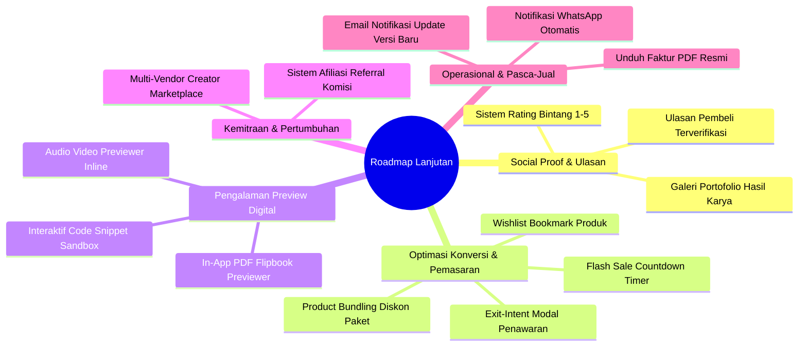

# Rekomendasi Fitur Lanjutan & Roadmap UI/UX E-Commerce Produk Digital
**Proyek:** Digital Insani (digital.insani.id)  
**Kategori:** UI/UX & Functional Expansion Roadmap  
**Status Dokumen:** Usulan Strategis & Panduan Pengembangan Masa Depan  
**Tanggal Dibuat:** September 2026  

---

## 1. Pendahuluan

Setelah penyelesaian Fase 1 dan Fase 2 (fondasi toko, katalog interaktif, live demo, tombol beli langsung, promo bar, dan dukungan WhatsApp), Digital Insani telah memenuhi standar modern toko online produk digital.

Namun, untuk bertransformasi menuju **Marketplace & Platform Produk Digital Skala Unggul** (setara dengan standar industri seperti Gumroad, Lemon Squeezy, atau Envato/ThemeForest), masih terdapat beberapa fitur lanjutan yang direkomendasikan untuk diimplementasikan pada fase pengembangan berikutnya.

Dokumen ini memetakan seluruh rekomendasi tersebut secara terstruktur beserta spesifikasi teknis dan pertimbangan bisnisnya.

---

## 2. Kategori Rekomendasi & Detail Fitur

---

### Kategori A: Social Proof & Ulasan Pengguna (Trust & Community)

#### A.1 Sistem Ulasan & Rating Terverifikasi (Verified Buyer Reviews)
* **Kebutuhan:** 
  Pada produk digital, calon pembeli sangat bergantung pada pengalaman pembeli sebelumnya karena barang tidak bisa dicoba secara fisik.
* **Spesifikasi:**
  - Rating bintang 1 sampai 5 beserta kolom teks ulasan dan opsional lampiran screenshot hasil penggunaan.
  - **Badge "Pembeli Terverifikasi":** Ulasan hanya dapat diberikan oleh pengguna yang akun atau emailnya memiliki transaksi `completed` atas produk tersebut (mencegah ulasan palsu).
  - Ringkasan rating pada header produk (misal: `⭐ 4.9 (42 Ulasan)`).
  - Baris distribusi grafik rating (persentase bintang 5, 4, 3, 2, 1).
* **Entitas Database Baru:**
  `reviews (id, user_id, order_item_id, product_id, rating, comment, is_approved, created_at)`

#### A.2 Showcase Karya Komunitas / Hasil Penggunaan (User Showcase)
* **Kebutuhan:**
  Menampilkan contoh website, dokumen, atau desain nyata yang dibuat oleh pembeli menggunakan template/aset dari Digital Insani.
* **Spesifikasi:**
  Seksi galeri interaktif dengan screenshot dan tautan ke karya asli pengguna untuk meningkatkan keyakinan prospek.

---

### Kategori B: Optimasi Konversi & Pemasaran (Sales & Average Order Value)

#### B.1 Fitur Bundling Produk (Paket Hemat Digital)
* **Kebutuhan:**
  Meningkatkan nilai rata-rata transaksi (*Average Order Value / AOV*) dengan menawarkan beberapa produk komplementer sekaligus dengan harga diskon khusus.
* **Spesifikasi:**
  - Seksi *"Sering Dibeli Bersama"* di halaman produk (misal: Template Frontend + Backend API + Panduan Deployment) dengan opsi centang langsung semua item.
  - Penghitungan diskon otomatis saat paket dimasukkan ke keranjang belanja.
* **Entitas Database Baru:**
  `product_bundles (id, title, discount_percentage, is_active)` dan `bundle_items`.

#### B.2 Dynamic Countdown Timer untuk Flash Sale
* **Kebutuhan:**
  Menciptakan urgensi (*fear of missing out / FOMO*) pada periode promosi tertentu (misal: Promo Gajian, Promo Tanggal Kembar).
* **Spesifikasi:**
  - Jam hitung mundur (hari, jam, menit, detik) yang dipasang pada kartu produk atau banner promo atas.
  - Otomatis menonaktifkan harga coret saat timer berakhir.

#### B.3 Wishlist / Bookmark Produk Favorit
* **Kebutuhan:**
  Memberikan fasilitas bagi pengunjung yang berminat pada suatu produk namun belum siap bertransaksi saat itu juga.
* **Spesifikasi:**
  - Tombol ikon hati (Wishlist) pada kartu produk dan detail produk.
  - Untuk pengguna login: disimpan ke database.
  - Untuk guest: disimpan di `localStorage` peramban.
  - Halaman khusus `/wishlist` untuk melihat daftar produk yang disimpan.

#### B.4 Exit-Intent Modal Penawaran Diskon
* **Kebutuhan:**
  Menangkap pengunjung yang berniat meninggalkan situs sebelum menyelesaikan checkout.
* **Spesifikasi:**
  - Mendeteksi kursor mouse yang bergerak cepat menuju penutupan tab (`mouseleave` pada `document`).
  - Menampilkan modal elegan berisi kupon diskon eksklusif 10% jika melakukan transaksi sekarang.

---

### Kategori C: Pengalaman Preview Digital yang Mendalam (Rich Digital Previews)

#### C.1 In-App PDF / E-Book Previewer
* **Kebutuhan:**
  Untuk kategori produk e-book atau dokumen panduan, calon pembeli ingin melihat daftar isi dan beberapa halaman awal.
* **Spesifikasi:**
  - Pembaca dokumen PDF interaktif langsung di halaman produk (menggunakan Mozilla `pdf.js` atau react-pdf).
  - Pembatasan preview: hanya menampilkan misal 5 sampai 10 halaman pertama sebagai sampel cuplikan.

#### C.2 Pemutar Audio & Video Inline (Audio/Video Player Preview)
* **Kebutuhan:**
  Untuk produk digital berbasis media (audio sampel, backsound, rekaman video kursus, atau motion graphics).
* **Spesifikasi:**
  - Audio waveform player (seperti Wavesurfer.js) dengan watermark audio lembut.
  - Video trailer embed dengan resolusi adaptif.

#### C.3 Sandboxing Code Snippet
* **Kebutuhan:**
  Untuk produk komponen software atau library script.
* **Spesifikasi:**
  Komponen tab interaktif dengan penyorot sintaks (*PrismJS / Shiki*) yang memungkinkan pengunjung menyalin contoh cuplikan kode penggunaan (misal: contoh impor modul atau file controller).

---

### Kategori D: Kemitraan & Pertumbuhan Ekosistem (Growth & Ecosystem)

#### D.1 Program Afiliasi Digital (Affiliate Marketing System)
* **Kebutuhan:**
  Mendorong kreator, blogger, dan pembeli setia untuk mempromosikan produk Digital Insani dan mendapatkan komisi dari setiap penjualan sukses.
* **Spesifikasi:**
  - Setiap member yang mendaftar program afiliasi mendapatkan tautan unik (`digital.insani.id/?ref=USERNAME`).
  - Pelacakan cookie referal (misal: aktif 30 hari).
  - Perhitungan komisi otomatis (%) saat transaksi afiliasi berstatus `completed`.
  - Dasbor afiliasi: melihat jumlah klik, total konversi, komisi tertunda, dan riwayat penarikan dana (*payout*).

#### D.2 Multi-Vendor / Creator Marketplace (Tahap Jangka Panjang)
* **Kebutuhan:**
  Membuka platform bagi kreator digital eksternal untuk mendaftar sebagai *Seller* dan menjual karyanya di Digital Insani dengan sistem bagi hasil (*revenue sharing*).

---

### Kategori E: Operasional & Retensi Pelanggan (Operations & Retention)

#### E.1 Unduh Faktur / Invoice Resmi Berformat PDF
* **Kebutuhan:**
  Banyak pembeli digital (terutama freelancer, agensi, dan perusahaan) membutuhkan bukti pembelian resmi untuk laporan pajak atau reimbursement operasional.
* **Spesifikasi:**
  - Tombol "Unduh Invoice PDF" di halaman status pesanan (`/checkout/status/{orderNumber}`) dan dasbor riwayat transaksi pembeli.
  - Dokumen PDF dibuat menggunakan `barryvdh/laravel-dompdf` dengan stempel lunas, rincian produk, nomor seri transaksi, dan detail toko.

#### E.2 Integrasi Gateway Notifikasi WhatsApp Otomatis
* **Kebutuhan:**
  Tingkat keterbacaan email di Indonesia sering kali lebih rendah dibanding WhatsApp.
* **Spesifikasi:**
  - Mengintegrasikan gateway WhatsApp (misal: Fonnte, Wablas, atau Twilio).
  - Begitu pembayaran Midtrans berhasil diverifikasi oleh webhook, sistem otomatis mengirimkan pesan konfirmasi WhatsApp berisi rincian pesanan dan tautan unduhan langsung ke nomor WhatsApp pembeli.

#### E.3 Notifikasi Email Otomatis saat Pembaruan Versi Baru (*Release Alert*)
* **Kebutuhan:**
  Menjaga keterikatan pelanggan dan memenuhi janji *Lifetime Updates*.
* **Spesifikasi:**
  - Saat admin mempublikasikan catatan rilis baru di modul `ProductUpdates`, sistem secara otomatis memicu background job queue untuk mengirimkan email pemberitahuan ke seluruh pembeli yang telah membeli produk tersebut.

---

## 3. Matriks Prioritas & Estimasi Dampak (Impact vs Effort Matrix)

| Fitur Rekomendasi | Dampak Bisnis (Impact) | Tingkat Usaha (Effort) | Rekomendasi Prioritas |
| :--- | :---: | :---: | :---: |
| **Ulasan & Rating Pembeli Terverifikasi (A.1)** | 🔴 Tinggi | 🟡 Sedang | **Prioritas 1 (Segera)** |
| **Unduh Faktur PDF Resmi (E.1)** | 🟡 Sedang | 🟢 Rendah | **Prioritas 1 (Segera)** |
| **Wishlist Produk Favorit (B.3)** | 🟡 Sedang | 🟢 Rendah | **Prioritas 2** |
| **Notifikasi WhatsApp Otomatis (E.2)** | 🔴 Tinggi | 🟡 Sedang | **Prioritas 2** |
| **Email Notifikasi Update Versi Baru (E.3)** | 🔴 Tinggi | 🟢 Rendah | **Prioritas 2** |
| **Product Bundling Paket Hemat (B.1)** | 🔴 Tinggi | 🟡 Sedang | **Prioritas 3** |
| **In-App PDF / Media Previewer (C.1/C.2)** | 🟡 Sedang | 🟡 Sedang | **Prioritas 3** |
| **Sistem Afiliasi Referral (D.1)** | 🔴 Tinggi | 🔴 Tinggi | **Prioritas 4** |
| **Multi-Vendor Marketplace (D.2)** | 🔴 Tinggi | 🔴 Sangat Tinggi | **Fase Jangka Panjang** |

---

## 4. Kesimpulan & Panduan Tindak Lanjut

Implementasi yang telah diselesaikan (Fase 1 dan Fase 2) telah memberikan fondasi e-commerce digital yang solid, estetis, dan sangat responsif. 

Untuk langkah selanjutnya, tim pengembang dapat merujuk ke **Prioritas 1** pada matriks di atas:
1. Membangun modul **Ulasan & Rating Pembeli Terverifikasi**, serta
2. Menyediakan generator **Faktur / Invoice PDF Resmi**.

Kedua fitur tersebut memiliki rasio dampak kepercayaan yang sangat tinggi dengan tingkat kompleksitas teknis yang terukur.
