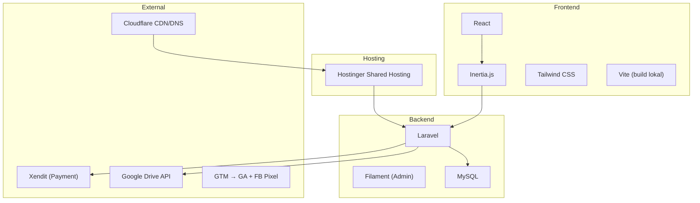
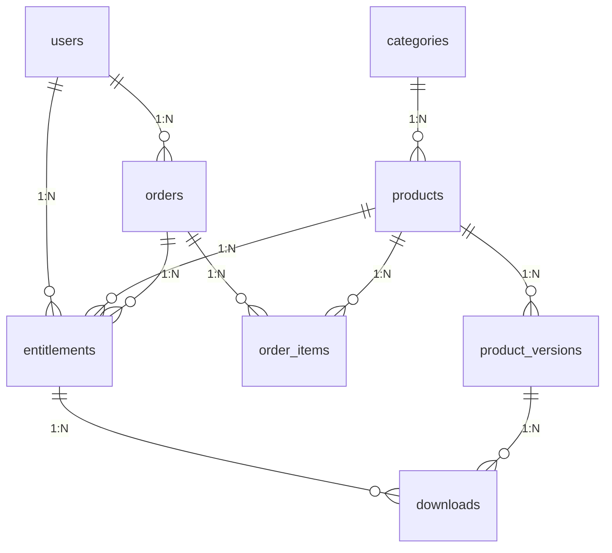

# Analisis Dokumentasi — digital.insani.id

## Ringkasan Proyek

**digital.insani.id** adalah toko produk digital (template, source code, UI kit, starter kit, aset digital) yang dibangun untuk **Insani Indonesia / Insani Indonesian Human Care** di bawah **Studio Nettra**. Website ini terpisah dari `insani.id` (WordPress donasi), meskipun dana masuk ke badan hukum yang sama.

---

## Struktur Dokumentasi

23 file markdown membentuk **spesifikasi teknis dan produk yang komprehensif**, diorganisir secara logis:

| # | File | Fungsi |
|---|------|--------|
| 00 | [README.md](file:///C:/laragon/www/digital%20insani/doc/README.md) | Index & prinsip arsitektur |
| 01 | [01-project-brief.md](file:///C:/laragon/www/digital%20insani/doc/01-project-brief.md) | Tujuan bisnis & konteks |
| 02 | [02-architecture.md](file:///C:/laragon/www/digital%20insani/doc/02-architecture.md) | Stack teknologi & constraint |
| 03 | [03-scope-and-requirements.md](file:///C:/laragon/www/digital%20insani/doc/03-scope-and-requirements.md) | Scope MVP & requirement |
| 04 | [04-user-roles-and-permissions.md](file:///C:/laragon/www/digital%20insani/doc/04-user-roles-and-permissions.md) | Role: Guest, Member, Admin |
| 05 | [05-functional-specification.md](file:///C:/laragon/www/digital%20insani/doc/05-functional-specification.md) | Alur bisnis detail |
| 06 | [06-pages-and-routes.md](file:///C:/laragon/www/digital%20insani/doc/06-pages-and-routes.md) | Struktur halaman & routing |
| 07 | [07-database-and-erd.md](file:///C:/laragon/www/digital%20insani/doc/07-database-and-erd.md) | Model data & relasi |
| 08 | [08-payment-xendit.md](file:///C:/laragon/www/digital%20insani/doc/08-payment-xendit.md) | Integrasi pembayaran |
| 09 | [09-file-delivery-google-drive.md](file:///C:/laragon/www/digital%20insani/doc/09-file-delivery-google-drive.md) | Delivery produk digital |
| 10 | [10-auth-membership.md](file:///C:/laragon/www/digital%20insani/doc/10-auth-membership.md) | Autentikasi & membership |
| 11 | [11-admin-filament.md](file:///C:/laragon/www/digital%20insani/doc/11-admin-filament.md) | Admin panel |
| 12 | [12-frontend-react-inertia.md](file:///C:/laragon/www/digital%20insani/doc/12-frontend-react-inertia.md) | Frontend architecture |
| 13 | [13-seo-og-analytics.md](file:///C:/laragon/www/digital%20insani/doc/13-seo-og-analytics.md) | SEO & tracking |
| 14 | [14-email-and-notifications.md](file:///C:/laragon/www/digital%20insani/doc/14-email-and-notifications.md) | Email transaksional |
| 15 | [15-security.md](file:///C:/laragon/www/digital%20insani/doc/15-security.md) | Keamanan |
| 16 | [16-testing-and-acceptance.md](file:///C:/laragon/www/digital%20insani/doc/16-testing-and-acceptance.md) | Testing & acceptance |
| 17 | [17-deployment-hostinger.md](file:///C:/laragon/www/digital%20insani/doc/17-deployment-hostinger.md) | Deploy ke shared hosting |
| 18 | [18-environment-and-configuration.md](file:///C:/laragon/www/digital%20insani/doc/18-environment-and-configuration.md) | Environment variables |
| 19 | [19-development-roadmap.md](file:///C:/laragon/www/digital%20insani/doc/19-development-roadmap.md) | Roadmap 11 fase |
| 20 | [20-ai-agent-rules.md](file:///C:/laragon/www/digital%20insani/doc/20-ai-agent-rules.md) | Aturan untuk AI agent |
| 21 | [21-design-system.md](file:///C:/laragon/www/digital%20insani/doc/21-design-system.md) | Warna, tipografi, layout |
| 22 | [22-open-questions.md](file:///C:/laragon/www/digital%20insani/doc/22-open-questions.md) | Pertanyaan terbuka |

---

## Technology Stack

---

## Arsitektur Aplikasi

**Satu project Laravel** dengan tiga area:

| Area | Teknologi | Akses |
|------|-----------|-------|
| Storefront publik | Laravel + Inertia + React + Tailwind | Semua user |
| Member area | Route Inertia + middleware `auth` | User terautentikasi |
| Admin panel | Filament di `/admin` | Admin saja |

> [!IMPORTANT]
> **Constraint Hostinger** yang krusial:
> - ❌ Tidak ada Node.js persistent process
> - ❌ Tidak ada SSR
> - ❌ Tidak ada persistent queue worker
> - ❌ Tidak ada websocket
> - ✅ Vite build dilakukan lokal/CI, `public/build/` ikut deploy
> - ✅ Cron job untuk Laravel scheduler
> - ✅ Webhook diproses synchronous

---

## Database Model

10 entitas inti dengan relasi yang jelas:

Entitas tambahan: `articles`, `site_settings`, `payment_webhook_events`

---

## Alur Bisnis Kritis

### Alur Checkout & Pembayaran
1. Customer pilih produk → backend buat order pending
2. Backend panggil Xendit Invoice API (`external_id: DIGIPROD-{order_id}`)
3. Customer diarahkan ke hosted Xendit payment page
4. Xendit kirim webhook → Laravel validasi & proses idempotent
5. Order → paid → Entitlement dibuat → Akses download tersedia

### Alur Download Produk
1. User request download → Laravel autentikasi
2. Cek entitlement → Pilih versi/file → Akses Drive via service account
3. Stream/proxy file → Catat download event

> [!WARNING]
> **Keamanan Payment (Shared Account)**
> Akun Xendit yang sama digunakan oleh `insani.id` (donasi). Webhook handler **wajib** filter berdasarkan prefix `external_id`:
> - `DONASI-...` → abaikan
> - `DIGIPROD-...` → proses
>
> Status: Menunggu approval Xendit (tiket #2711200, per 31 Agustus 2026)

---

## Routing Lengkap

| Grup | Route | Halaman |
|------|-------|---------|
| **Public** | `/` | Home |
| | `/products` | Catalog |
| | `/products/{slug}` | Detail produk |
| | `/checkout/{order}` | Checkout/status |
| | `/articles` | Index artikel |
| | `/articles/{slug}` | Detail artikel |
| | `/refund-policy`, `/terms`, `/privacy-policy` | Legal pages |
| **Auth** | `/login`, `/register`, `/forgot-password` | Auth flows |
| **Member** | `/member` | Dashboard |
| | `/member/products` | Produk yang dibeli |
| | `/member/products/{product}` | Akses produk |
| | `/member/products/{product}/download` | Secure download |
| | `/member/updates` | Update produk |
| | `/member/profile` | Profil |
| **Admin** | `/admin` | Filament panel |

---

## Development Roadmap

```mermaid
gantt
    title Roadmap 11 Fase
    dateFormat X
    axisFormat %s

    section Planning
    Phase 0 - Decisions & Onboarding    :p0, 0, 1
    section Core
    Phase 1 - Foundation (Laravel+React+Filament) :p1, 1, 2
    Phase 2 - Catalog                   :p2, 2, 3
    Phase 3 - Checkout + Xendit         :p3, 3, 4
    Phase 4 - Membership + Entitlement  :p4, 4, 5
    Phase 5 - Google Drive Integration  :p5, 5, 6
    Phase 6 - Product Updates/Versioning :p6, 6, 7
    section Enrichment
    Phase 7 - SEO & Tracking            :p7, 7, 8
    Phase 8 - Admin Operations          :p8, 8, 9
    section Launch
    Phase 9 - Hardening & Testing       :p9, 9, 10
    Phase 10 - Production Launch        :p10, 10, 11
```

---

## Kualitas Dokumentasi

### ✅ Kelebihan

| Aspek | Penilaian |
|-------|-----------|
| **Kelengkapan** | Sangat baik — mencakup semua layer dari bisnis hingga deployment |
| **Konsistensi** | Keputusan arsitektur konsisten di seluruh dokumen |
| **Keamanan** | Penekanan kuat pada keamanan payment, download, dan credential |
| **Constraint awareness** | Hostinger shared hosting constraint diulang dan dihormati |
| **AI Agent rules** | 14 aturan spesifik untuk mencegah AI membuat keputusan bisnis sendiri |
| **Idempotency** | Diperlakukan sebagai first-class concern pada payment webhook |
| **Pemisahan concern** | Jelas membedakan autentikasi vs entitlement vs otorisasi |
| **Open questions** | Jujur mendokumentasikan hal yang belum diputuskan |

### ✅ Keputusan Bisnis yang Sudah Dijawab (Update 31 Agustus 2026)

| Keputusan | Jawaban |
|-----------|--------|
| **Guest checkout** | Diizinkan; email + nomor telepon wajib diisi. Jika register dengan email yang sama, riwayat transaksi otomatis muncul di dashboard |
| **Auto-create account setelah payment** | Tidak wajib |
| **Email verification** | Wajib hanya saat registrasi akun |
| **Download setelah webhook** | Tersedia langsung |
| **Limit download** | Ya, dibatasi jumlah percobaan |
| **Expiry download link** | Ya, 24 jam |
| **Download per versi** | Ya, setiap versi bisa didownload terpisah |
| **Update notification** | Keduanya: email + member area |
| **Invoice PDF** | Ya, generate dan kirim via email |
| **Receipt di member area** | Ya, bisa didownload |
| **Diskon/kupon** | Ya; perlu menu khusus untuk membuat kode kupon dan set persentase diskon |
| **Model produk** | Berbasis versi, bukan lisensi |
| **Kategori produk** | Customizable (bisa diatur admin) |
| **Refund policy** | Disusun berdasarkan dokumentasi Xendit |
| **Taxonomy artikel** | Author Contributions |
| **Taxonomy produk** | Termasuk variasi produk (perlu klarifikasi lebih lanjut) |
| **Approval konten legal** | Admin |
| **Branding** | Buat fitur management untuk ganti logo dan judul situs |
| **Brand colors** | Belum ada yang spesifik; gunakan pedoman umum |
| **Infrastruktur** | Per dokumentasi Hostinger; Cloudflare setup nanti |
| **Google Drive** | Dimiliki pemilik proyek |
| **Backup** | Ya, termasuk |

### ⚠️ Item yang Masih Pending

| Item | Detail |
|------|--------|
| **Xendit shared account approval** | Belum ada respons dari Xendit — production checkout blocked |
| **Supported payment methods** | Mengikuti dokumentasi Xendit |
| **Production fees/rates** | Belum ada |
| **Webhook configuration** | Belum dikonfirmasi oleh Xendit |
| **Cloudflare configuration** | Akan di-setup nanti |
| **SMTP limit Hostinger** | Perlu dicek sesuai dokumentasi Hostinger |

---

## Open Questions (dari [22-open-questions.md](file:///C:/laragon/www/digital%20insani/doc/22-open-questions.md))

Dari **~25 pertanyaan awal**, sebagian besar sudah dijawab oleh pemilik proyek. Sisa yang masih pending:

| # | Kategori | Item Pending |
|---|----------|-------------|
| 1 | **Payment** | Xendit shared account approval, webhook config, production rates |
| 2 | **Infrastruktur** | SMTP limit Hostinger, Cloudflare setup detail |
| 3 | **Branding** | Exact brand color values (gunakan pedoman umum untuk sekarang) |
| 4 | **Produk** | Klarifikasi: apakah "product taxonomy = product variations" berarti satu produk bisa punya varian (Basic/Pro)? |

> [!NOTE]
> Sebagian besar keputusan bisnis sudah terjawab dan bisa langsung diimplementasikan. AI Agent tetap **dilarang** menjawab pertanyaan yang tersisa tanpa keputusan pemilik proyek.

---

## Penilaian Kesiapan

| Dimensi | Status | Catatan |
|---------|--------|---------|
| Spesifikasi teknis | 🟢 Siap | Stack, DB, routing, alur bisnis terdefinisi |
| Keamanan | 🟢 Siap | Aturan detail untuk payment, download, credential |
| Frontend spec | 🟢 Siap | Struktur komponen, state management, accessibility |
| Admin panel | 🟢 Siap | Filament resources terdefinisi jelas |
| Deployment | 🟢 Siap | Constraint Hostinger terdokumentasi baik |
| Testing criteria | 🟢 Siap | Automated + manual acceptance criteria lengkap |
| Business decisions | 🟢 Siap | Sebagian besar keputusan sudah dijawab oleh pemilik proyek |
| Checkout flow | 🟢 Siap | Guest checkout + email/phone wajib; download link 24 jam + limit |
| Branding/Design | 🟡 Parsial | Arah visual ada; fitur management logo/title akan dibuat |
| Fitur tambahan | 🟡 Baru | Kupon/diskon + invoice PDF + variasi produk perlu diimplementasikan |
| Xendit production | 🔴 Blocked | Menunggu approval merchant support |

---

## Kesimpulan

Dokumentasi ini **sangat matang dan terstruktur dengan baik** untuk sebuah proyek yang dibangun dengan bantuan AI agent. Secara teknis, spesifikasi sudah cukup detail untuk memulai development dari **Phase 1 (Foundation) hingga Phase 10 (Production)**.

**Phase 0 (Decisions & Onboarding) sudah hampir selesai** — sebagian besar keputusan bisnis telah dijawab oleh pemilik proyek. Keputusan baru yang menambah scope implementasi:

- **Sistem kupon/diskon** — perlu tabel `coupons`, Filament resource, dan logic kalkulasi harga
- **Invoice PDF** — perlu PDF generator (DomPDF/Snappy) + kirim via email
- **Download link expiry 24 jam + limit percobaan** — perlu signed URL/token mechanism
- **Fitur management logo/title** — extend `site_settings` di Filament
- **Variasi produk** — perlu klarifikasi apakah ini berarti varian per produk (Basic/Pro)

**Satu-satunya blocker untuk production** adalah approval Xendit (tiket #2711200). Development penuh bisa dimulai segera untuk semua fase, dengan payment integration dibangun di staging/test terlebih dahulu.
